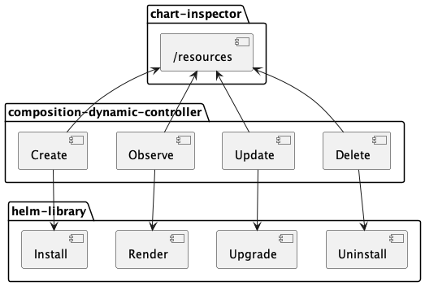

# Composition Dynamic Controller
The composition-dynamic-controller is an operator that is instantiated by the [core-provider](https://github.com/krateoplatformops/core-provider) to manage the Custom Resources whose Custom Resource Definition is generated by the core-provider.

## Summary

- [Summary](#summary)
- [Architecture](#architecture)
- [Overview](#overview)
- [Examples](#examples)
- [Configuration](#configuration)
  

## Architecture




## Overview

The composition-dynamic-controller is an operator designed to manage the lifecycle of a Helm chart based on specifications defined within its Custom Resource (CR) and the actions performed on [this CR](https://github.com/krateoplatformops/core-provider/blob/1233e2a80ebaa4ef7816596b27f64d820e9b2f26/testdata/compositiondefinition-postgresql-oci.yaml).

In practice, when a Custom Resource (CR) is created, the instance of composition-dynamic-controller enabled to manage this specific Group Version Kind (GVK), checks if a Helm release associated with the CR already exists in the cluster. If not, it performs an `helm install` using the values specified in the CR to create a new release. However, if the release does already exist, it instead executes an `helm upgrade`, updating the release's values with those specified in the CR. Additionally, when the CR is deleted from the cluster, the instance of the composition-dynamic-controller performs an `helm uninstall` on the release.

The status of the composition is True if the realease has been correctly installed.

### RBAC Generation

Starting from release `0.16.0`, the `composition-dynamic-controller` automatically generates its own RBAC (Role-Based Access Control) policy. Prior to this, RBAC configurations needed to be manually defined. The controller leverages `chart-inspector` to obtain a list of the resources involved in the chart installation. Based on this information, the `composition-dynamic-controller` dynamically creates the necessary RBAC policy, ensuring that the appropriate roles and permissions are granted for managing the Helm chart resources.

This automatic RBAC generation simplifies deployment and ensures that the `composition-dynamic-controller` has the required permissions to perform operations like `helm install`, `helm upgrade`, and `helm uninstall`, depending on the status of the associated Custom Resource (CR). The dynamic creation of RBAC policies eliminates the need for manual intervention, streamlining the operational workflow and ensuring a more seamless experience when managing resources with `composition-dynamic-controller`.

## Examples

```yaml
apiVersion: composition.krateo.io/v12-8-3
kind: Postgresql
metadata:
  name: sample
  namespace: krateo-system
spec:
  architecture: standalone
```

The manifest described above represents a Custom Resource (CR) of kind Postgresql, and its apiVersion is composition.krateo.io/v12-8-3. This CRD was generated by the core-provider based on the specifications outlined in [the CompositionDefinition](https://github.com/krateoplatformops/core-provider/blob/1233e2a80ebaa4ef7816596b27f64d820e9b2f26/testdata/compositiondefinition-postgresql-oci.yaml). Applying this manifest within the cluster initiates the installation of a chart associated with the corresponding instance of the composition-dynamic-controller. 

## Configuration

### Operator Env Vars

These enviroment varibles can be changed in the Deployment of the composition-dynamic-controller we need to tweak.

| Name                                   | Description                | Default Value | Notes         |
|:---------------------------------------|:---------------------------|:--------------|:--------------|
| COMPOSITION_CONTROLLER_DEBUG           | dump verbose output        | false         |               |
| COMPOSITION_CONTROLLER_WORKERS         | number of workers          | 1             |               |
| COMPOSITION_CONTROLLER_RESYNC_INTERVAL | resync interval            | 3m            |               |               
| COMPOSITION_CONTROLLER_GROUP           | resource api group         |               | populated by `core-provider` |
| COMPOSITION_CONTROLLER_VERSION         | resource api version       |               | populated by `core-provider` |
| COMPOSITION_CONTROLLER_RESOURCE        | resource plural name       |               | populated by `core-provider` |
| COMPOSITION_CONTROLLER_SA_NAME         | cdc deployment ServiceAccount name |  | populated by `core-provider` |
| COMPOSITION_CONTROLLER_SA_NAMESPACE        | cdc deployment ServiceAccount namespace | populated by `core-provider` |
| URL_PLURALS                            | url to krateo pluraliser service       | `http://snowplow.krateo-system.svc.cluster.local:8081/api-info/names`  |   
| URL_CHART_INSPECTOR                    | url to chart inspector   |  `http://chart-inspector.krateo-system.svc.cluster.local:8081/`             |   
| KRATEO_NAMESPACE                       | namespace where krateo is installed       |  krateo-system |
| HELM_REGISTRY_CONFIG_PATH | default helm config path | /tmp |
| HELM_MAX_HISTORY | Max Helm History | 10 |
| COMPOSITION_MAX_ERROR_RETRY_INTERVAL | The maximum interval between retries when an error occurs. This should be less than the half of the poll interval. |  0m |
| COMPOSITION_MIN_ERROR_RETRY_INTERVAL | The minimum interval between retries when an error occurs. This should be less than max-error-retry-interval. | 1m |