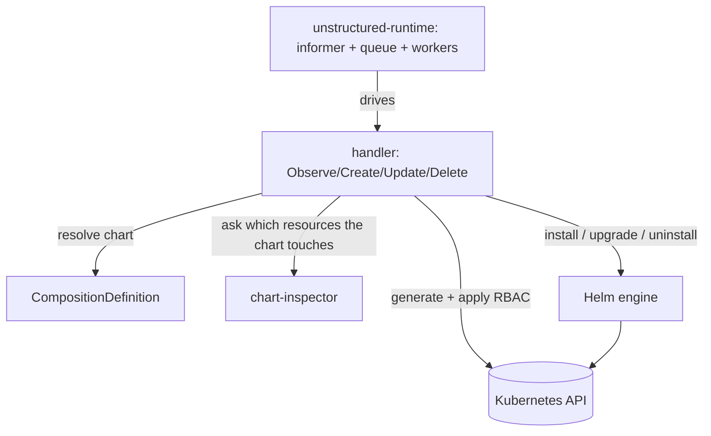

# Architecture

How the CDC is organized, how it boots, and — the question everyone asks first — **how a CDC instance knows which composition it is responsible for**.

## The CDC supplies logic; the runtime owns the loop

The CDC does not implement an informer, a work queue, or a reconcile loop. Those live in **unstructured-runtime**. The CDC implements one thing — the four reconcile operations (`Observe`, `Create`, `Update`, `Delete`) — registers them with the runtime, and lets the framework drive them. Everything operates on dynamic, untyped objects; the CDC knows nothing about the chart's types at compile time.

## The main parts

- **The handler** — implements the four operations. This is the entirety of the CDC's business logic.
- **The chart resolver** — works out the chart's location, version, and credentials for a given resource: either a fixed chart (when one is configured) or, more usually, by reading it from the resource's `CompositionDefinition`.
- **The chart-inspector client** — asks chart-inspector which resources the chart touches.
- **The RBAC generator and installer** — turn that list into roles and bindings, and apply them.
- **The release processor** — decodes the rendered release and computes a digest used to detect drift.

## Component view

The authoritative reconcile flowchart is [`../../_diagrams/cdc-flow.puml`](../../_diagrams/cdc-flow.puml) (at the repository root).

## How it boots

Startup is short: read configuration, build a structured JSON logger, connect to the cluster, pick the chart resolver (fixed or dynamic), set up telemetry, build the label selector that scopes this controller to its composition version, construct the handler, and hand everything to the runtime to run.

One important choice happens here: the CDC tells the runtime to treat an **update** to a watched resource as an **observe** event. So even a spec change first runs `Observe` — which reconciles Helm and decides whether anything is actually out of date — rather than jumping straight to an update path. See [`02-reconcile-lifecycle.md`](./02-reconcile-lifecycle.md).

## How a CDC is launched, and which composition it manages

A CDC instance is pinned to one composition type by **three things together**:

1. **The watched resource type** — the group, version, and resource it is told to watch at launch. This is the informer's target.
2. **A composition-version label selector** — so the controller only sees instances of *its* version. This is what lets multiple CDC versions coexist for the same kind.
3. **The namespace** — all namespaces, or a specific one.

core-provider sets all of these when it deploys the CDC, along with the chart-inspector URL and the identity the controller should use for the RBAC it generates.

### Finding the CompositionDefinition

Unless a fixed chart is configured, the chart's coordinates come from the `CompositionDefinition`, resolved at reconcile time. The resolver first tries labels on the resource that point directly at its definition; failing that, it lists the definitions and matches on the kind and version they report. With several candidate definitions and no disambiguating labels, it stops with an error rather than guessing. Once it has the definition, it reads the chart reference (URL, version, repository, credentials) from it.
