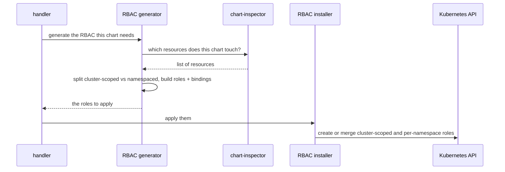

# RBAC generation

How the CDC grants *itself* exactly the permissions a chart needs — by asking chart-inspector which resources the chart touches, turning that into roles, and applying them under its own identity. This runs on every reconcile, before the Helm upgrade.

## The pipeline

1. **Ask chart-inspector** which resources the chart touches (see the **chart-inspector** developer guide; remember its result reflects what was *touched* and may contain duplicates).
2. **Build roles** — a cluster-scoped role and binding for cluster-scoped resources, and a per-namespace role and binding for namespaced ones, all bound to the CDC's own identity. The grants are **broad** (all verbs on the reported resources) — this is the obvious place to tighten policy if you want least-verb rather than least-resource.
3. **Apply them.** Application is **additive**: it only adds rules that aren't already present.

## Two consequences worth flagging

- **Permissions only grow during a composition's life.** Because application is additive, if a chart's resource set *shrinks*, the now-unnecessary rules are not removed — cleanup happens only when the composition is deleted.
- **Identity coupling is load-bearing.** The identity configured for the bindings must be the same identity the CDC pod actually runs as. If they differ, the bindings grant permissions to a different identity than the pod uses, so the pod still can't manage the chart's resources even though the roles were "applied successfully." When debugging "forbidden" errors despite RBAC being present, check this first.
