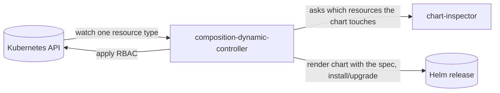

# composition-dynamic-controller (CDC) — Developer Guide

A contributor-facing guide to **Krateo's execution engine**: the controller that turns each `Composition` instance into a reconciled Helm release.

> Audience: engineers who **contribute to, extend, or debug the CDC** — not end users. This guide explains *ideas and flows*, not line-by-line code. For product concepts, see [docs.krateo.io](https://docs.krateo.io/key-concepts/kco/cdc/overview).

## Role in KCO

KCO turns Helm charts into Kubernetes-native APIs. **core-provider** generates a CRD from a chart's values schema and deploys, **per `CompositionDefinition`, one CDC** — this repo — telling it which resource to watch. The CDC (built on **unstructured-runtime**) watches that single resource; for each `Composition` instance it resolves the chart, renders it using the instance's spec as Helm values, and applies it as a Helm release, then keeps it reconciled. To scope its own **least-privilege RBAC**, the CDC asks **chart-inspector** which resources the chart touches and generates roles for exactly those.

The CDC is **not composition-specific at compile time** — a single binary watches whatever resource it is told to. Everything composition-specific comes from the chart and from how the controller is launched. The reconcile loop itself lives in **unstructured-runtime**; the CDC supplies only the business logic. See [`01-architecture.md`](./01-architecture.md).

## Documents in this folder

| Document | What it covers |
| --- | --- |
| [`01-architecture.md`](./01-architecture.md) | The main parts, how the controller boots, and **how a CDC is launched / which composition it manages**. |
| [`02-reconcile-lifecycle.md`](./02-reconcile-lifecycle.md) | What happens on each reconcile, the Helm flow, drift detection, graceful pause, and the **Observe-mutation** behavior. |
| [`03-rbac-generation.md`](./03-rbac-generation.md) | How the CDC scopes its own permissions per chart, and the identity coupling that makes it work. |
| [`04-extending.md`](./04-extending.md) | Where to make common changes. |

## See also

- **Ecosystem overview (canonical)** — the whole KCO pipeline lives in the **core-provider** repo: `core-provider/docs/developer-guide/00-ecosystem-overview.md`.
- **The framework** — the CDC is built on **unstructured-runtime**; its developer guide documents the reconcile loop and the contract the CDC plugs into.
- **Logging** — `docs/logs-ingester-compatibility.md`. **Telemetry / metrics** — `telemetry/`.
- **Design note** — `docs/observe-reconciliation-loop-184.md` analyses the Observe-mutation behavior discussed in [`02`](./02-reconcile-lifecycle.md).
- **Reconcile flow diagram (source)** — [`../../_diagrams/cdc-flow.puml`](../../_diagrams/cdc-flow.puml) (at the repository root).
